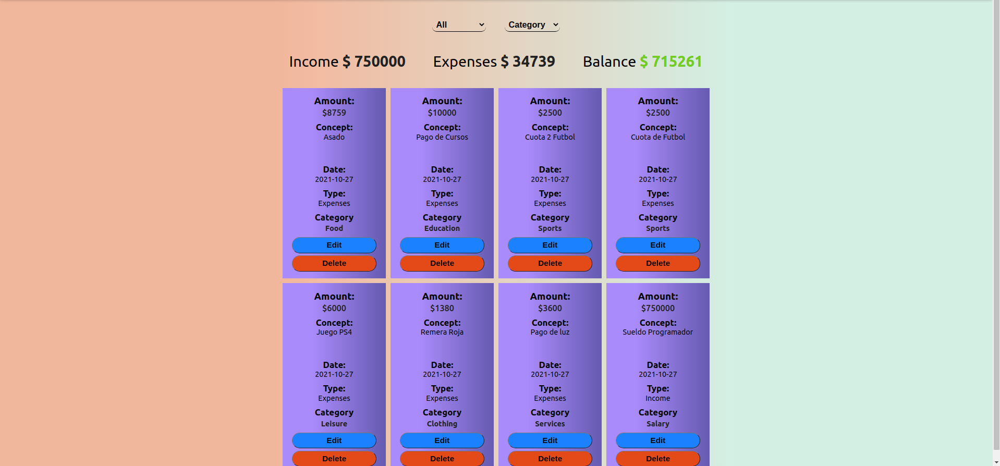
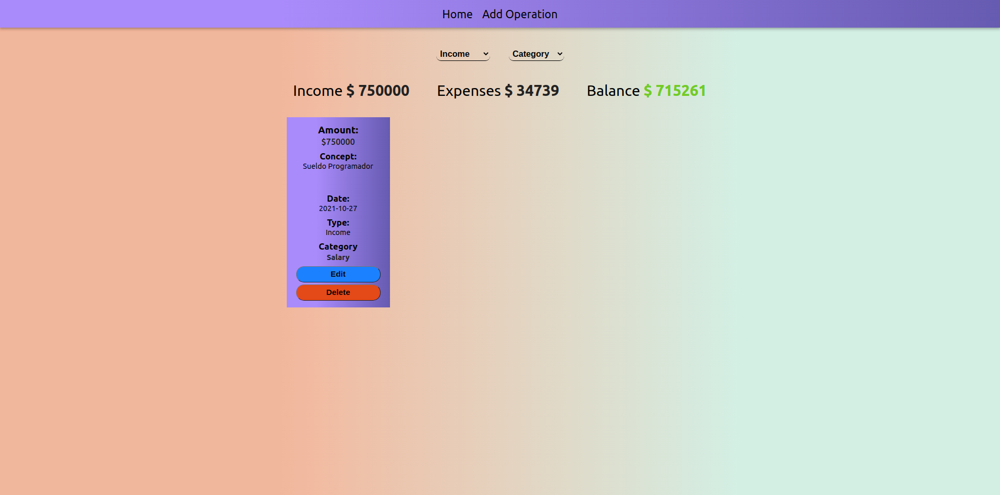
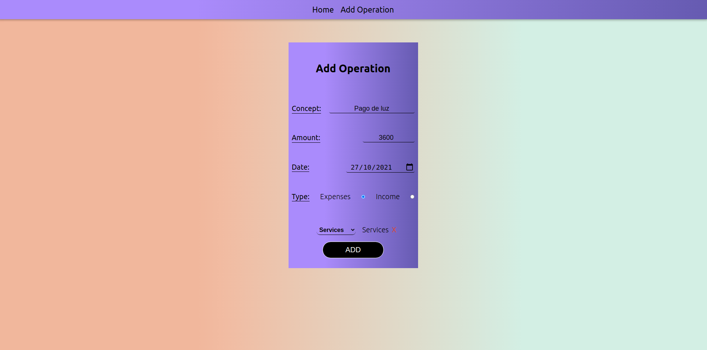
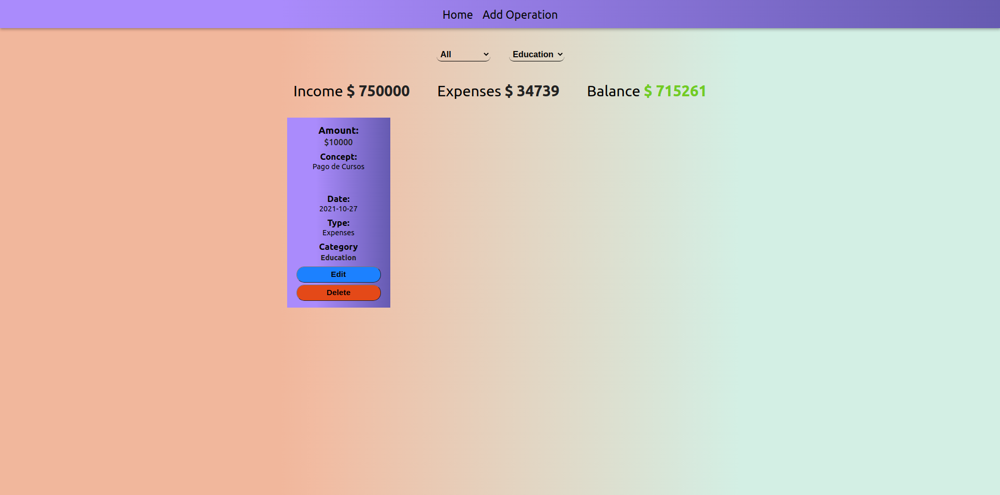
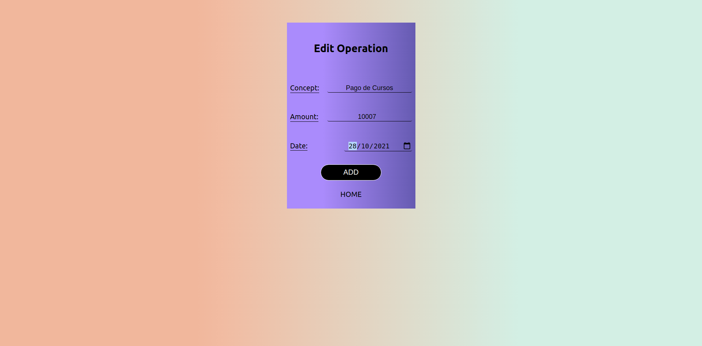

<h2> Alkemy Challenge Full Stack </h2>

<h3>Home</h3>

 La pantalla de inicio deberá mostrar el balance actual, es decir, el resultante de los
    ingresos y egresos de dinero cargados, y un listado de los últimos 10 registrados.
    ABM de operaciones (ingresos y egresos)
    La aplicación deberá contener:

 
    
Formulario de registro de operación. El mismo deberá contener:

    <ul>
        <li>Concepto</li>
        <li>Monto</li>
        <li>Fecha</li>
        <li>Tipo (ingreso o egreso)</li>
    </ul>
    
Listado de operaciones registradas según su tipo (ingreso o egreso).

    <ul>
        <li> Desde el listado, se debe poder modificar o eliminar una operación registrada
            previamente. No debe ser posible modificar el tipo de operación (ingreso o
            egreso) una vez creada.
        </li>
    </ul>

<h3> Bonus </h3>

De forma adicional, puede
Autenticación de usuarios
Agregar un formulario de registro y login para permitir identificar al usuario que utiliza la
aplicación, y vincular las operaciones registradas al usuario autenticado en el sistema,
tanto para el listado y creación de nuevos registros. Los datos indispensables para permitir
el ingreso deben ser un email y contraseña, pudiendo agregar los que se deseen.

Categorías de operaciones
Agregar la funcionalidad de categorizar las operaciones registradas en el gestor, como por
ejemplo, una categoría “comida” para categorizar egresos. Adicionalmente, agregar la
posibilidad de listar operaciones por categoría. 

<h5>Criterios a Evaluar</h5>

<ul>
    <li>El diseño debe ser responsive, pudiendo utilizarse CSS puro o algún framework
    de Frontend</li>
    <li>Código limpio, buenas prácticas de programación, en idioma inglés</li>
    <li>Correcto diseño de la base de datos</li>
    <li>Buenas prácticas de GIT: Commits declarativos y atomizados</li>
    <li>Buenas prácticas para el nombre de rutas</li>    
</ul>
